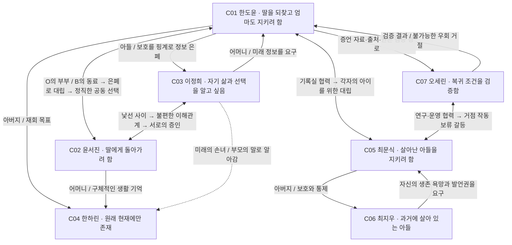

# 05. 인물관계도와 관계 변화

선은 혈연·혼인 관계와 감정적 요구를 구분해서 읽는다. 도윤·서진은 O에서 부부였지만 B의 서류상으로는 아직 만난 적 없는 사람이다. 정희는 B에서 아직 며느리나 손녀를 만난 적이 없다.

## 관계도

## 방향별 요구와 숨기는 것

| 방향 | 상대에게 바라는 것 | 말하지 않는 진짜 두려움 | 충돌을 행동으로 드러내기 |
|---|---|---|---|
| 도윤 → 정희 | 곁에 있어주면서 귀환도 이해해주기 | 엄마를 직접 포기한 사람이 되는 것 | 전체 보고서 대신 요약본만 보여줌 |
| 정희 → 도윤 | 자신을 판단 가능한 성인으로 대하기 | 아들의 행복을 막는 존재가 되는 것 | 요약본을 돌려주고 원문을 요구함 |
| 서진 → 도윤 | 딸을 되찾는 약속을 실행하기 | 엄마를 위해 자신과 하린을 포기할까 봐 | 다음 행동과 기한을 구체적으로 물음 |
| 도윤 → 서진 | 엄마도 지킬 방법을 기다려주기 | 이미 엄마를 선택한 사람으로 보이는 것 | 조사 중이라는 말로 질문을 피함 |
| 서진 → 정희 | 자신의 귀환 의지를 이해하기 | 살아 있는 정희를 질투하는 자기 마음 | 단둘이 외출해서 처음으로 사실대로 말함 |
| 정희 → 서진 | 하린을 실제 아이로 알려주기 | 손녀가 단지 자신을 밀어낼 이유로 남는 것 | 버릇·음식·싫어하는 것을 물음 |
| 문식 → 도윤 | 살아난 사람을 '오류'로 부르지 않기 | 아들이 다시 죽어야 정상이라는 평가 | 공개 자료에 지우의 증언을 요구함 |
| 도윤 → 문식 | 거점을 사적 결론의 도구로 쓰지 않기 | 문식을 설득하지 못하면 딸을 잃는 것 | 문식의 손실을 지우지 않은 공개 기록을 전달함 |
| 지우 → 문식 | 살고 싶다는 자기 뜻도 직접 듣기 | 아버지의 슬픔 속에 갇힌 사람이 되는 것 | 자신의 발언을 아버지 대신 읽지 못하게 함 |
| 세린 → 도윤 | 자료와 해석을 분리하기 | 기대가 사실을 덮는 것 | 개인 이전을 가능성처럼 홍보하지 말라고 경고함 |

## 관계의 변화표

| 관계 | 초반 | 중반의 파손 | 후반의 변화 | 결말에 남는 것 |
|---|---|---|---|---|
| 도윤·서진 | 같은 아이를 기억하는 동료 | S22: 도윤의 지연과 은폐를 확인 | S32: 양쪽 두려움을 말함. S40: 복귀를 공동 선택 | 동일 감정을 요구하지 않는 부부 |
| 도윤·정희 | 재회의 기쁨과 설명 불균형 | S23–24: 정희가 원문을 읽고 항의 | S38–39: 정희 자신의 욕망과 작별을 들음 | 엄마의 양보를 쉽게 해석하지 않는 아들 |
| 서진·정희 | 모르는 사이에 생긴 가족 호칭 | 하린을 되찾는 일이 정희를 잃는 일임을 앎 | S25·S29: 함께 외출하고 서로의 말을 기록 | 서진이 기억하는 정희는 희생 역할 이상의 사람 |
| 도윤·문식 | 상실 기록의 협력자 | S19: '아이를 살린다'는 같은 목표로 대립 | S36: 반대 증언까지 공개, S42: 운영 통제 복원 | 화해를 강요하지 않는 상실의 공동 기록 |
| 문식·지우 | 아버지만 재회의 의미를 앎 | 아버지의 과잉 통제와 아들의 공포 | S26·S42: 아들이 자기 발언의 주체가 됨 | 돌아간 문식이 불완전한 아들을 기억하기로 함 |
| 도윤·세린 | 제보자와 검증자 | 가능성 홍보와 개인 이전 요구 | 증거의 한계와 기술적 불가능을 공유 | 불확실성을 숨기지 않는 기록 |

## 장면에서 확인할 것

관계가 바뀌는 장면에서는 같은 정보를 듣고 모두 같은 반응을 하지 않게 한다. 정희가 자신의 죽음을 알면 도윤은 죄책감을, 서진은 귀환의 난점을, 정희는 남은 삶에 대한 분노와 욕망을 느낄 수 있다. 관계 변화는 인물의 선언만이 아니라 다음 장면의 행동 변화로 확인한다.
